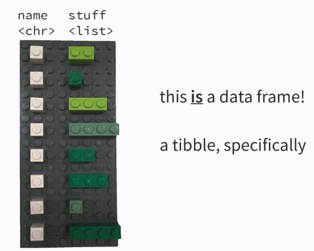

```{r warning=FALSE, message=FALSE}
library(tidyverse)
library(googledrive)
```

```{r}
drive_auth(reset = TRUE)
```

For more info on this see:

* Github [tidyverse/googledrive](https://github.com/tidyverse/googledrive)
* extensive documentation on [Managing OAuth Tokens](https://rawgit.com/jennybc/googlesheets/master/vignettes/managing-auth-tokens.html) from the package authors. (Thank you, @JennyBryan)
* my [August 2018 BARUG googlesheets presentation](https://rawgit.com/dsdaveh/talks-and-tutorials/master/googlesheets_BARUG_Presentation/README.html). Specifically [this part](https://rawgit.com/dsdaveh/talks-and-tutorials/master/googlesheets_BARUG_Presentation/gsheet_oauth.nb.html)


```{r}
mydrive <- drive_find()
```

```{r}
tr25 <- drive_find(pattern = "Tr", n_max = 25)
tr25
```

Get more info on `drive_find` at (http://googledrive.tidyverse.org/) where you'll learn to 

* Find files
* Upload files
* Share files
* Publish files
* Download files

## But wait a sec... What the heck is a dribble?

```{r}
tr25 %>% drive_reveal(what = c('mime_type'))
```

“path”, “trashed”, “mime_type”, “permissions”, “published”

But 'path' can be slow
```{r}
tr25 %>% drive_reveal(what = 'path')
```

And 'permissions' may be complicated

```{r}
tr25_perms <- tr25 %>% drive_reveal(what = 'permissions')
tr25_perms
```

Permissions is a list (like drive_resource). We'll take a look at the first `file` that is shared and look at its permissions

```{r}
first_shared <- tr25_perms %>%
  filter(shared) %>%
  slice(1)
first_shared
first_perms <- first_shared$permissions_resource
```


```{r}
xx <- first_perms[[1]]$permissions
perms <- tibble(role = map_chr(xx, 'role'),
                type = map_chr(xx, 'type'),
                name = map_chr(xx, 'displayName'))
perms
```

Dribbles are drive tibbles with list-cols

* Using list-cols in your dataframe – RStudio  [Video](https://www.rstudio.com/resources/videos/using-list-cols-in-your-dataframe/) [Speaker Deck](https://speakerdeck.com/jennybc/putting-square-pegs-in-round-holes-using-list-cols-in-your-dataframe)
* Tutorial - (https://jennybc.github.io/purrr-tutorial/ls13_list-columns.html) 



So dribbles can be manipulated using the regular tidyverse tools
```{r}
# tr25 %>% drive_reveal(what = c('mime_type'))
tr25 %>% mutate(mime_type = map_chr(drive_resource, 'mimeType')) 
```

Which is helpful when drive_reveal doesn't support what we want to 'promote' from our dribble
```{r}
# tr25 %>% drive_reveal(what = c('mime_type'))
tr25 %>% mutate(created = map_chr(drive_resource, 'createdTime') %>% as.Date()) 
```
