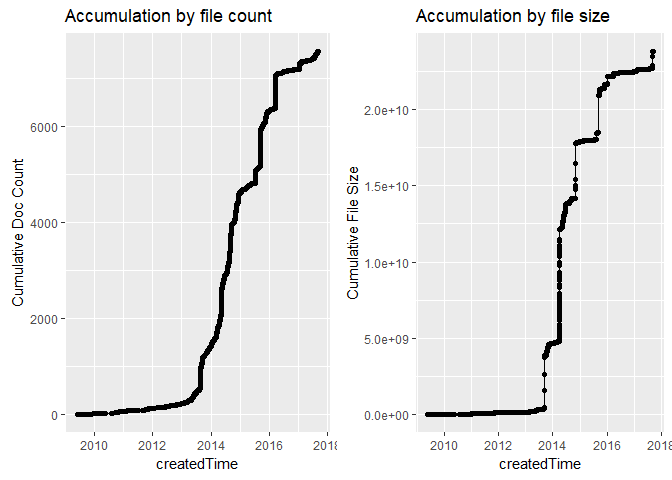
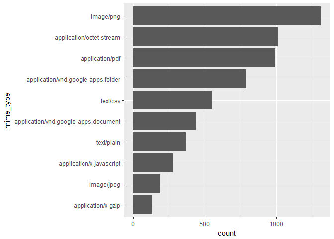
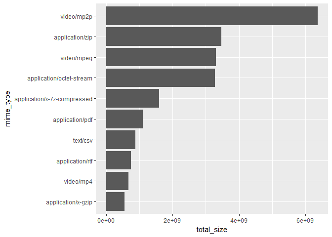
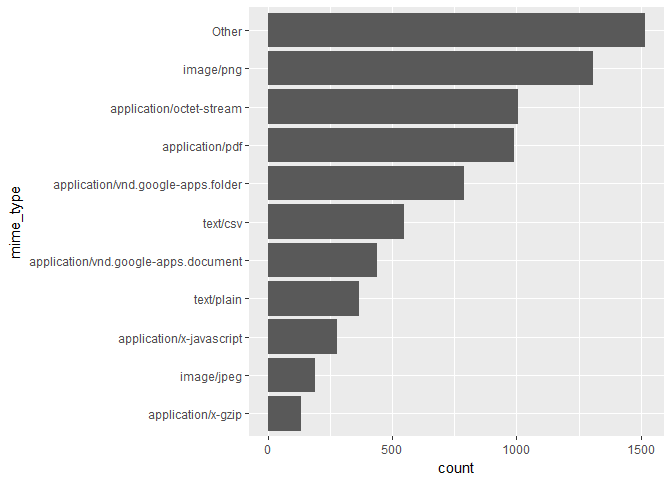
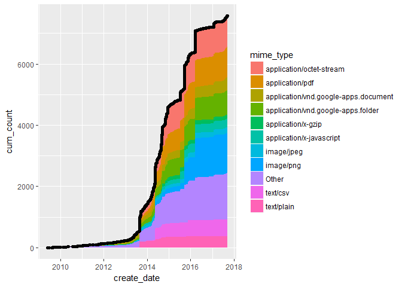
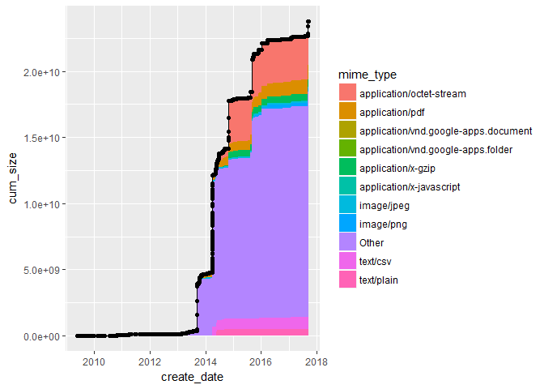

# Analysis of my Google Drive files (WIP)
Dave Hurst  


```r
library(tidyverse)
library(stringr)
library(googledrive)
library(googlesheets)
library(lubridate)
library(data.tree)
library(cowplot)
library(tictoc)
theme_set(theme_gray())
```


```r
cached = TRUE
cache_all <- 'all.rds'
if (file.exists(cache_all) && cached) {
    files <- readRDS(cache_all)
} else {
    tic()
    files <- drive_find()
    saveRDS(files, cache_all)
    toc()
}
```

Let's look at both count and size accumulation over time. Note that file size is only counted for files that are stored in native format (i.e. not Google Docs)


```r
files <- files %>% googledrive:::promote('createdTime')
plot_by_count <- files %>% 
    mutate(createdTime = ymd_hms(createdTime),
           `Cumulative Doc Count` = row_number(createdTime)) %>% 
    ggplot(aes(createdTime, `Cumulative Doc Count`, group=1)) + geom_line() + geom_point() +
    ggtitle('Accumulation by file count')
```

```
## Warning: package 'bindrcpp' was built under R version 3.4.1
```

```r
files <- files %>% googledrive:::promote('quotaBytesUsed') %>% 
    mutate(q_size = as.numeric(quotaBytesUsed))
total_size <- sum(files$q_size)

plot_by_size <- files %>% 
    arrange(createdTime) %>%
    mutate (createdTime = ymd_hms(createdTime),
            `Cumulative File Size` = cumsum(q_size)) %>% 
    ggplot(aes(createdTime, `Cumulative File Size`, group=1)) + geom_line() + geom_point() +
    ggtitle('Accumulation by file size')
plot_grid(plot_by_count, plot_by_size)
```

<!-- -->

Interesting. There seem to be several days where a lot of files got added to my Drive. I use the Drive desktop app which automatically syncs files from my PC, so maybe I got a little careless about adding files into that folder. It's also noteworthy that the size explosion and count explosions don't always occur on the same days, so I'll need to look at those separately.  

Total quota file size is 23.8 GB.

Let's start with largest files, and see which Drive paths contain them.


```r
fat_files <- files %>% 
    arrange(-q_size) %>%
    top_n(10, q_size) %>%
    drive_reveal(what = 'path') %>%
    googledrive:::promote('quotaBytesUsed') %>%  #drive_reveal crunched our dribble 
    mutate(sizeGB = round(as.numeric(quotaBytesUsed) / 1e9, 2))
```

```
## Items so far:
```

```
## 200
```

```
## 300
```

```
## 400
```

```
## 500
```

```
## 600
```

```
## 700
```

```
## 789
```

```
## 
```

```r
fat_files %>% select(path, sizeGB)
```

```
## # A tibble: 10 x 2
##                                                                           path
##  *                                                                       <chr>
##  1                                   ~/NU MSPA/436-TA/TA Posts/demo videos.zip
##  2 ~/NU MSPA/453 - Text Analytics/yelp_dataset_challenge_academic_dataset/yelp
##  3  ~/Family Writings and Videos/Harry Hurst Home Movies/VIDEO_TS/VTS_01_1.VOB
##  4  ~/Family Writings and Videos/Harry Hurst Home Movies/VIDEO_TS/VTS_01_3.VOB
##  5  ~/Family Writings and Videos/Harry Hurst Home Movies/VIDEO_TS/VTS_01_2.VOB
##  6 ~/NU MSPA/453 - Text Analytics/yelp_dataset_challenge_academic_dataset/revi
##  7 ~/Career/DS Projects/BikeShare Open Data Challenge/201402_rebalancing_data.
##  8 ~/Coursera/Data Science Track/Text Analytics Capstone/Coursera-SwiftKey.zip
##  9                                     ~/SKL-Share-tmp/GitLab/3sq_OSA_utils.7z
## 10                                                   ~/Temp/weddingcap_rain.7z
## # ... with 1 more variables: sizeGB <dbl>
```

There are a couple of files there I don't need or could get online, but otherwise this makes me just want to go watch a few family vids. So a little savings are possible, but nothing much overly noteworthy. The zz_GitHub looks like something I shouldn't be paying to keep around.

Let's look at the files by the chronological order they were added and look at the days with the most volume.


```r
fat_days <- files %>% mutate(create_date = createdTime %>% as.Date() %>% as.character()) %>%
    count(create_date, sort = TRUE) %>%
    top_n(10, n)
fat_days
```

```
## # A tibble: 10 x 2
##    create_date     n
##          <chr> <int>
##  1  2015-09-19   702
##  2  2016-03-20   684
##  3  2013-08-23   418
##  4  2014-05-16   336
##  5  2015-07-11   244
##  6  2014-09-12   167
##  7  2014-05-09   160
##  8  2014-11-03    98
##  9  2017-01-22    92
## 10  2015-11-14    83
```

That's a lot of files. There are probably some folders here that are adding a lot of unnecessary files. Looking up paths can take a long time with the `drive_reveal`. So I want to take a the approach of sampling files added on the days we just identified above. On the assumption that something caused large folders to get added to my drive, this should help me identify those.


```r
set.seed(199)
tic()
fat_day_sample <- files %>% 
    mutate(create_date = createdTime %>% as.Date() %>% as.character()) %>%
    semi_join(fat_days) %>%
    group_by(create_date) %>%
    mutate(shuffle = sample(n())) %>%
    top_n(10, shuffle) %>%
    drive_reveal(what = 'path')
```

```
## Joining, by = "create_date"
```

```
## Items so far:
```

```
## 200
```

```
## 300
```

```
## 400
```

```
## 500
```

```
## 600
```

```
## 700
```

```
## 789
```

```
## 
```

```r
toc()
```

```
## 57.3 sec elapsed
```

```r
#prune until any children of a node don't have a minimum threshold
prune_min <- 15 #Clone doesn't have ...
pruneFunction <- function(x) {
    if (isLeaf(x)) return(FALSE)
    if (x$totalCount < prune_min) return(FALSE)
    return( x$totalCount >= prune_min )
}
    
tree <- as.Node(fat_day_sample, pathName = "path")
pruned <- Clone(tree, pruneFun = pruneFunction)
print(pruned, 'totalCount', pruneMethod = 'dist', limit = NULL)
```

```
##                                                    levelName totalCount
## 1  ~                                                                 23
## 2   ¦--NU MSPA                                                        9
## 3   ¦   ¦--ImageAnalytics                                             4
## 4   ¦   ¦   °--Books                                                  3
## 5   ¦   ¦       °--Case Studies, 2nd Edition                          2
## 6   ¦   ¦           °--code                                           1
## 7   ¦   ¦--401 Statistics                                             3
## 8   ¦   ¦   °--Elementary Statistics-Triola Text Supplements          2
## 9   ¦   ¦       °--AppB_Data_Sets                                     1
## 10  ¦   °--453 - Text Analytics                                       1
## 11  ¦--Data Science                                                   5
## 12  ¦   °--PyImageSearch                                              4
## 13  ¦       °--Books                                                  3
## 14  ¦           °--Case Studies, 2nd Edition                          2
## 15  ¦               °--code                                           1
## 16  ¦--Coursera                                                       7
## 17  ¦   °--Data Science Track                                         6
## 18  ¦       °--Developing Data Products                               5
## 19  ¦           °--Week2                                              4
## 20  ¦               °--Quiz2                                          3
## 21  ¦                   °--libraries                                  2
## 22  ¦                       °--frameworks                             1
## 23  °--Tableau Repository                                             1
```


```r
cache_folders <- TRUE
cache_folders_file <- 'folders.rds'
if (cache_folders && file.exists(cache_folders_file)) {
    folders <- readRDS(cache_folders_file)
} else {
    tic()
    folders <- files %>% 
        drive_reveal(what = 'mime_type') %>% 
        filter(str_detect(mime_type,'apps.folder$')) %>%
        drive_reveal(what = 'path') 
    saveRDS(folders, cache_folders_file)
    toc()
}
```

```r
ftree <- as.Node(folders, pathName = "path")
ftree$Do(function(x) x$origCount <- x$count)
prune_min <- 10 #Clone doesn't have ...
fpruned <- Clone(ftree, pruneFun = pruneFunction)
print(fpruned, 'totalCount', 'origCount', pruneMethod = 'dist', limit = NULL)
```

```
##                                                    levelName totalCount
## 1  ~                                                                 72
## 2   ¦--Career                                                         2
## 3   ¦   °--2017                                                       1
## 4   ¦--Data Science                                                   5
## 5   ¦   °--PyImageSearch                                              4
## 6   ¦       °--Books                                                  3
## 7   ¦           °--Case Studies, 2nd Edition                          2
## 8   ¦               °--code                                           1
## 9   ¦--Tahoe Condo                                                    1
## 10  ¦--Coursera                                                      29
## 11  ¦   ¦--Big Data Specialization - UCSD                             1
## 12  ¦   ¦--Data Science Track                                        23
## 13  ¦   ¦   ¦--Text Analytics Capstone                                9
## 14  ¦   ¦   ¦   °--SwiftKey                                           8
## 15  ¦   ¦   ¦       ¦--.Rproj.user                                    2
## 16  ¦   ¦   ¦       ¦   °--C991E9B3                                   1
## 17  ¦   ¦   ¦       ¦--ShinyText                                      3
## 18  ¦   ¦   ¦       ¦   °--.Rproj.user                                2
## 19  ¦   ¦   ¦       ¦       °--C991E9B3                               1
## 20  ¦   ¦   ¦       °--SimpleTest                                     2
## 21  ¦   ¦   ¦           °--.Rproj.user                                1
## 22  ¦   ¦   °--Developing Data Products                              13
## 23  ¦   ¦       ¦--Week2                                              5
## 24  ¦   ¦       ¦   ¦--.Rproj.user                                    1
## 25  ¦   ¦       ¦   °--Quiz2                                          3
## 26  ¦   ¦       ¦       °--libraries                                  2
## 27  ¦   ¦       ¦           °--frameworks                             1
## 28  ¦   ¦       ¦--Rfiles                                             4
## 29  ¦   ¦       ¦   °--.Rproj.user                                    3
## 30  ¦   ¦       ¦       ¦--D8D9354F                                   1
## 31  ¦   ¦       ¦       °--1506BF51                                   1
## 32  ¦   ¦       °--shiny_demo                                         3
## 33  ¦   ¦           °--demo                                           2
## 34  ¦   ¦               °--.Rproj.user                                1
## 35  ¦   ¦--Machine Learning (Stanford)                                1
## 36  ¦   °--Computing for Data Analyis                                 3
## 37  ¦       °--.Rproj.user                                            2
## 38  ¦           °--D8D9354F                                           1
## 39  ¦--NU MSPA                                                       24
## 40  ¦   ¦--498-Capstone                                               2
## 41  ¦   ¦   °--PREDICT 498 - Capstone - Team Folder                   1
## 42  ¦   ¦--ImageAnalytics                                             6
## 43  ¦   ¦   °--Books                                                  5
## 44  ¦   ¦       ¦--Practical Python and OpenCV, 2nd Edition           2
## 45  ¦   ¦       ¦   °--code                                           1
## 46  ¦   ¦       °--Case Studies, 2nd Edition                          2
## 47  ¦   ¦           °--code                                           1
## 48  ¦   ¦--480 - Business Leadership                                  1
## 49  ¦   ¦--412 - Advanced Modeling                                    2
## 50  ¦   ¦   °--PREDICT 412 - Team Project - Sports                    1
## 51  ¦   ¦--453 - Text Analytics                                       6
## 52  ¦   ¦   ¦--R453 Text Analytics                                    3
## 53  ¦   ¦   ¦   °--.Rproj.user                                        2
## 54  ¦   ¦   ¦       °--C991E9B3                                       1
## 55  ¦   ¦   °--TwitterSentiment                                       2
## 56  ¦   ¦       °--.Rproj.user                                        1
## 57  ¦   ¦--411 - Predictive Modelling II                              1
## 58  ¦   ¦--410 Predictive Modeling I                                  1
## 59  ¦   °--401 Statistics                                             4
## 60  ¦       °--Elementary Statistics-Triola Text Supplements          3
## 61  ¦           °--AppB_Data_Sets                                     2
## 62  ¦               °--Text Files                                     1
## 63  ¦--Sports Teams                                                   1
## 64  ¦--Tax Records                                                    1
## 65  ¦--Family Writings and Videos                                     1
## 66  ¦--Seagate DS                                                     5
## 67  ¦   °--Auto Advanced Config Analysis                              4
## 68  ¦       °--Rfiles                                                 3
## 69  ¦           °--.Rproj.user                                        2
## 70  ¦               °--D8D9354F                                       1
## 71  °--Tableau Repository                                             2
## 72      °--Shapes                                                     1
##    origCount
## 1         42
## 2          7
## 3         10
## 4          9
## 5          1
## 6          2
## 7          2
## 8          7
## 9          9
## 10         9
## 11         4
## 12         9
## 13         3
## 14         7
## 15         2
## 16         5
## 17         2
## 18         2
## 19         5
## 20         2
## 21         1
## 22         3
## 23         3
## 24         1
## 25         2
## 26         2
## 27         2
## 28         2
## 29         2
## 30         4
## 31         4
## 32         1
## 33         2
## 34         1
## 35         9
## 36         2
## 37         1
## 38         4
## 39        17
## 40         4
## 41        10
## 42         1
## 43         2
## 44         1
## 45        10
## 46         2
## 47         7
## 48         5
## 49        13
## 50        14
## 51         9
## 52         5
## 53         3
## 54         4
## 55         1
## 56         1
## 57        15
## 58        10
## 59         4
## 60         4
## 61         7
## 62        24
## 63        10
## 64         8
## 65        12
## 66         2
## 67         1
## 68         1
## 69         2
## 70         4
## 71         8
## 72        10
```


```r
files <- files %>% drive_reveal(what = 'mime_type')
```

```r
file_types <- files %>%
    group_by(mime_type) %>%
    summarize(count = n(),
              total_size = sum(q_size)) %>%
    arrange( -count)
file_types
```

```
## # A tibble: 66 x 3
##                               mime_type count total_size
##                                   <chr> <int>      <dbl>
##  1                            image/png  1308  248956551
##  2             application/octet-stream  1008 3282496556
##  3                      application/pdf   991 1098422750
##  4   application/vnd.google-apps.folder   789          0
##  5                             text/csv   550  883381352
##  6 application/vnd.google-apps.document   438          0
##  7                           text/plain   367  504657823
##  8             application/x-javascript   277   12832381
##  9                           image/jpeg   189  132630223
## 10                   application/x-gzip   133  542808095
## # ... with 56 more rows
```


```r
top_ftype <- 10
file_types %>%
    top_n(top_ftype, count) %>%
    mutate(mime_type = reorder(mime_type, count)) %>%
    ggplot(aes(mime_type, count)) + geom_col() + coord_flip() 
```

<!-- -->


```r
top_ftype <- 10
file_types %>%
    arrange(total_size) %>%
    top_n(top_ftype, total_size) %>%
    mutate(mime_type = reorder(mime_type, total_size)) %>%
    ggplot(aes(mime_type, total_size)) + geom_col() + coord_flip() 
```

<!-- -->


```r
top_ftype <- 10
top_mime_types <- file_types %>%
    top_n(top_ftype, count) %>%
    select(mime_type) %>% .[[1]]
top_mime_types
```

```
##  [1] "image/png"                           
##  [2] "application/octet-stream"            
##  [3] "application/pdf"                     
##  [4] "application/vnd.google-apps.folder"  
##  [5] "text/csv"                            
##  [6] "application/vnd.google-apps.document"
##  [7] "text/plain"                          
##  [8] "application/x-javascript"            
##  [9] "image/jpeg"                          
## [10] "application/x-gzip"
```


```r
files_otherized <- files %>%
    mutate(mime_type = ifelse(mime_type %in% top_mime_types, mime_type, 'Other')) 
files_otherized %>%
    group_by(mime_type) %>%
    summarize(count = n(),
              total_size = sum(q_size)) %>%
    arrange( -count) %>%
    mutate(mime_type = reorder(mime_type, count)) %>%
    ggplot(aes(mime_type, count)) + geom_col() + coord_flip() 
```

<!-- -->


```r
files_cum <- files %>% 
    arrange(createdTime) %>%
    mutate(create_date = as.Date(ymd_hms(createdTime)),
           `Cumulative Doc Count` = row_number(createdTime),
           `Cumulative File Size` = cumsum(q_size)) 


cum_types <- files_otherized %>% 
    mutate(create_date = as.Date(ymd_hms(createdTime))) %>%
    #filter(create_date > ymd('2017-01-01')) %>%
    group_by(create_date, mime_type) %>%
    summarize(count = n(),
              total_size = sum(q_size)) %>% 
    ungroup() %>%
    complete(create_date, mime_type, fill = list(count = 0, total_size = 0)) %>%
    group_by(mime_type) %>% arrange(create_date) %>%
    mutate( cum_count = cumsum(count),
            cum_size = cumsum(total_size)) 
cum_all <- cum_types %>% ungroup() %>%
    group_by(create_date) %>%
    summarize( day_count = sum(count),  
               day_size = sum(total_size)) %>%
    ungroup() %>% arrange(create_date) %>%
    mutate( count_all = cumsum(day_count),
            size_all = cumsum(day_size))
    
plot_cum_counts <- cum_types %>%
    ggplot(aes(create_date, cum_count)) +
    geom_area(aes(fill = mime_type)) +
    geom_line(data = files_cum, aes(create_date, `Cumulative Doc Count`, group=1)) + 
    geom_point(data = files_cum, aes(create_date, `Cumulative Doc Count`, group=1))
plot_cum_counts
```

<!-- -->


```r
plot_cum_size <- cum_types %>%
    ggplot(aes(create_date, cum_size)) +
    geom_area(aes(fill = mime_type)) +
    geom_line(data = files_cum, aes(create_date, `Cumulative File Size`, group=1)) + 
    geom_point(data = files_cum, aes(create_date, `Cumulative File Size`, group=1))
plot_cum_size
```

<!-- -->
